# Nexus Search — n8n Automation

An n8n workflow that orchestrates the Nexus Search pipeline end-to-end: search API with caching, hybrid BM25 + vector retrieval, RAG answer generation, document ingestion, a full web crawler (robots.txt, SSRF guard, incremental recrawl), link-graph PageRank, and health/alerting.

## What it does

The workflow is a single canvas with **75 connected nodes**, organized into six blocks:

| Block | Trigger | What happens |
|---|---|---|
| **Search API** | `Webhook: POST /nexus/search` | Parses the query → checks Redis cache → fans out to BM25 (Postgres full-text) and vector search (OpenAI embeddings + Qdrant) in parallel → merges & fuses scores → applies ranking → optionally runs RAG (prompt build → GPT answer → citation/confidence scoring) → caches and returns the response |
| **Ingestion API** | `Webhook: POST /nexus/ingest` | Detects MIME type → routes to the right extractor (PDF / spreadsheet / HTML / plain text) → builds a unified document model → content-hash dedup check → chunks long documents → stores the document → embeds each chunk → upserts vectors into Qdrant |
| **Web Crawler** | `Schedule Trigger` | Pulls due URLs from the frontier → normalizes + SSRF-guards each one → fetches/parses robots.txt → checks crawl permission → fetches the page (conditional GET) → extracts content + outgoing links → stores the page and updates the frontier → respects crawl delay |
| **Link Intelligence** | `Schedule Trigger` | Loads the link graph → computes PageRank → stores updated scores → posts a summary to Slack |
| **Monitoring** | `Schedule Trigger` | Collects metrics (crawl stats, Redis health) → stores them → flags unhealthy state → fans out alerts to Slack and email |
| **Error Handling** | `Error Trigger` | Catches failures from any branch → logs to a dead-letter table → alerts Slack and email |

## Node types used (all real, no placeholders)

| Type | Count | Used for |
|---|---|---|
| `code` | 19 | Parsing, scoring, fusion, ranking, prompt building — business logic glue |
| `postgres` | 12 | Document store, frontier, link graph, metrics, dead-letter log |
| `httpRequest` | 7 | OpenAI Embeddings, OpenAI Chat, Qdrant search/upsert, page/robots.txt fetch |
| `if` | 6 | Cache hit, RAG requested, duplicate check, crawl allowed, content changed, unhealthy |
| `respondToWebhook` | 4 | Search response, ingest response, duplicate response, cached response |
| `redis` | 3 | Cache lookup/store, health check |
| `scheduleTrigger` | 3 | Crawl, PageRank, and metrics schedules |
| `slack` / `emailSend` | 5 | Alerting (health + errors) and PageRank reporting |
| `webhook` | 2 | Search API and Ingest API entry points |
| `crypto` | 2 | Content hashing, cache key generation |
| `extractFromFile` / `html` | 4 | PDF/spreadsheet extraction, HTML parsing |
| `splitOut` | 2 | Fanning out URLs and document chunks |
| `merge` / `switch` / `wait` / `noOp` / `errorTrigger` | 5 | Flow control, rate-limiting delay, error entry point |

## Flow diagram

```mermaid
flowchart TD
    subgraph Search["Search API"]
        A1[Webhook: /nexus/search] --> A2[Parse Query]
        A2 --> A3[Cache Lookup - Redis]
        A3 -->|hit| A4[Respond Cached]
        A3 -->|miss| A5[Fan Out Retrieval]
        A5 --> A6[BM25 Candidates - Postgres]
        A5 --> A7[Embed Query] --> A8[Qdrant Search]
        A6 --> A9[Merge Candidates]
        A8 --> A9
        A9 --> A10[Hybrid Fusion]
        A10 --> A11[Advanced Ranking]
        A11 --> A12[Snippets and Paginate]
        A12 --> A13{RAG Requested?}
        A13 -->|yes| A14[Build Prompt] --> A15[GPT Answer] --> A16[Citations and Confidence]
        A13 -->|no| A17[Cache Store]
        A16 --> A17
        A17 --> A18[Respond Search]
    end

    subgraph Ingest["Ingestion API"]
        B1[Webhook: /nexus/ingest] --> B2[Detect MIME and Metadata]
        B2 --> B3[Route By Type]
        B3 --> B4[Extract PDF / Spreadsheet / HTML / Text]
        B4 --> B5[Build Document Model]
        B5 --> B6[Content Hash] --> B7{Duplicate?}
        B7 -->|yes| B8[Respond Duplicate]
        B7 -->|no| B9[Chunk Document] --> B10[Store Document]
        B10 --> B11[Split Chunks] --> B12[Embed Chunks] --> B13[Qdrant Upsert]
        B13 --> B14[Respond Ingested]
    end

    subgraph Crawl["Web Crawler"]
        C1[Schedule Trigger] --> C2[Fetch URL Frontier]
        C2 --> C3[Normalize and SSRF Guard]
        C3 --> C4[Fetch robots.txt] --> C5{Crawl Allowed?}
        C5 -->|no| C6[Skip URL]
        C5 -->|yes| C7[Fetch Page] --> C8{Content Changed?}
        C8 -->|no| C9[Mark Unchanged]
        C8 -->|yes| C10[Extract Links] --> C11[Store Page and Links]
        C11 --> C12[Crawl Delay] --> C13[Update Frontier]
    end

    subgraph Link["Link Intelligence"]
        D1[Schedule Trigger] --> D2[Load Link Graph] --> D3[Compute PageRank] --> D4[Store PageRank] --> D5[Slack Report]
    end

    subgraph Mon["Monitoring and Alerting"]
        E1[Schedule Trigger] --> E2[Collect Metrics] --> E3{Unhealthy?}
        E3 -->|yes| E4[Alert Slack and Email]
    end

    subgraph Err["Error Handling"]
        F1[On Workflow Error] --> F2[Dead-letter Log] --> F3[Error Slack and Email]
    end
```

## How to import

1. Download [`nexus-search-workflow.json`](./nexus-search-workflow.json) from this folder.
2. In n8n: **Workflows → Import from File** (or drag the file onto the canvas).
3. Set credentials for: Postgres, Redis, Qdrant (HTTP header auth), OpenAI, Slack, Email.
4. Replace the placeholder Qdrant URLs (`__PLACEHOLDER_VALUE__...`) in the **Qdrant Search** and **Qdrant Upsert** nodes with your actual collection endpoint.
5. Activate the workflow to make the two webhooks (`/nexus/search`, `/nexus/ingest`) live.

## Known limitations (documented honestly, not hidden)

- **Independent implementation, not orchestration.** This workflow reimplements search/ranking natively in n8n (Postgres full-text search + OpenAI/Qdrant) rather than calling the audited Python FastAPI backend in this repo. The two systems use separate datastores and will **not** return identical rankings for the same query — the Postgres `ts_rank_cd` scoring here is not equivalent to the project's BM25 implementation (no title boost, no phrase-required matching, no chunk grouping).
- **SSRF guard is weaker than the Python crawler's.** The `Normalize & SSRF Guard` node is a regex hostname blocklist. It does not cover the full `172.16.0.0/12` private range, does not perform DNS resolution (so a hostname that resolves to a private IP via DNS will not be caught), and does not re-validate on redirect hops the way the Python `fetcher.py` does. If you plan to point this crawler at untrusted seed URLs, harden this node first.
- Treat this workflow as a standalone demo/automation layer, not a drop-in replacement for the tested Python core.